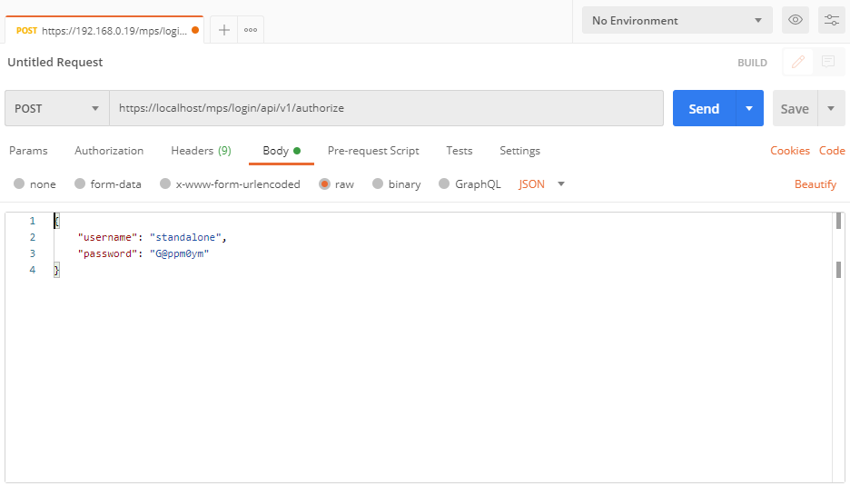
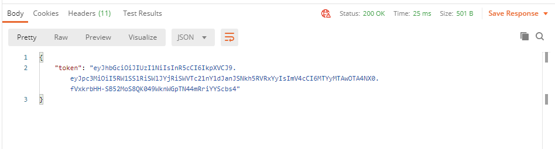

# Resources for the Open AMT Cloud Toolkit Workshop


## Other REST API Call Examples

### Node.js

View our [REST API Call tutorial](https://open-amt-cloud-toolkit.github.io/docs/1.3/Tutorials/apiTutorial/). Includes a walkthrough and example code for how to get an Authorization Token and then make a call to get all devices of the MPS server.

### cURL

Find additional information on curl in [their documentation](https://curl.se/docs/manpage.html).

Example Authorize
```
curl -k -X POST -H "Content-Type: application/json" -d "{\"username\": \"standalone\", \"password\": \"G@ppm0ym\"}" https://localhost/mps/login/api/v1/authorize
```

Example Get Devices
```
curl -k -H "Authorization: Bearer <Your-JWT-Token>" -X GET https://localhost/mps/api/v1/devices
```

### Postman

The following steps will show how to construct the Authorize API call via Postman:

1. Select New in the top-left corner or 'Create a Request' via the Launchpad.

2. Change 'Get' to 'Post' via the drop-down.

3. Enter the [Authorize API URL](https://app.swaggerhub.com/apis-docs/rbheopenamt/mps/1.3.0#/Auth/post_api_v1_authorize).

    ```
    https://localhost/mps/login/api/v1/authorize
    ```

4. In the 'Body' tab, select 'raw' and then 'JSON' from the drop down.

5. Provide the body according to Authorize API docs.

```
{
    "username": "standalone",
    "password": "G@ppm0ym"
}
```

6. Send.

Example Input



Example Output




If there is an authorization error, ensure SSL certificate verification is set to **OFF** in the Settings menu.